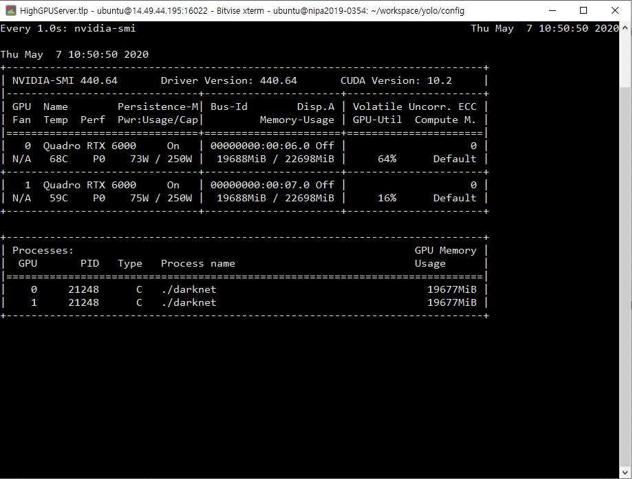

## Training YOLO with Custom Dataset in PyTorch
- working on anaconda environment with pyThon36-pyTorch-tf-office.yml  
- backup dataset!! is located in /workspace/dataset/yolo/data/itms_xxxx(version)
   ```angular2html
  20200929
   ** 합천 데이터를 추가하고 training 진행.
   --> 
   
  20200806
   ** 테스트 결과, transfer learning을 한 것이 scratch로 한 것보다 효과적이며 특히, 세밀하게 에러가 줄어든 경우 (100000 부타는 에러에 가까운 96000 같은 것이 성능이 더 좋음)
   --> 왜냐하면 아직 다양한 데이터가 없기 때문인것으로 파악함...
   --> 그래서 transfer learning + iteration 증가 + anchor 조정으로 실험예정
   ->> 박스형태가 너무 세로 직사각형만 나오네.. 영상이 줄어들길 때문...인것 같다. 
   - itms-dark-yolov3-tiny_3l_v3-4.cfg (v2에서 anchor와 iteration 횟수만 바꿈 from 86000부터..시작)
   - (3l) minimum loss value is 0.345318 at 147659 iteration
   - (full)  
  
  20200804
   - itms-dark-yolov3-tiny_3l-v3-3.cfg(?)
   - training from scratch with itms-dark-yolov3-tiny_3l-v3-2.cfg
   - (3l) minimum loss value is 0.409529 at 97273 iteration (0.425289 at 100000)
  20200731
   - itms-dark-yolov3-tiny_3l-v3-2.cfg
   - randomize dataset and training
   - cfg 이름 변경은 weights 파일이름 변경 때문   
   - (full) 
   - (3l) minimum loss value is 0.31344 at 84952 iteration
  
  20200729
   - itms-dark-yolov3-tiny_3l-v3-1.cfg
   - 여주에서 취득한 데이터(11M)를 첨가 하여 재 학습하고 있음.
   - 내용은 아래 20200506 과 같지만 config 파일에서 batch = 128, sub = 4로 수정하여 진행 (속도 때문에 작을 수록 빠름.....)
   - ./logplots/itms-train-full-1-highGPU-20200731-train-loss-plot.png
   - (full) minimum loss value is 0.197329 at 92000 iteration
   - (3l) minimum loss value is 0.314967 at 93688 iteration
  20200506
   - itms-dark-yolov3-tiny_3l-v3.cfg
   - 416 x 416 size
   - same with the previous one excepet the max iter and learning rate with learning_rate=0.001
    burn_in=1000
    max_batches = 100000
    policy=steps
    steps=20000,80000,90000
    scales=.1,.1,.1   
   - minimum loss value is 0.365762 at 77735 iteration (전의 것: - minimum loss value is 0.597947 at 8379 iteration) 
  
   - 20200507 : with highGPUs 두 장으로 돌림.. (50 hours for 100000 iterations with 256 / 4 batch)
     training starting with the command as: 
     ./darknet detector train /workspace/yolo/config/itms-darknet-v1.data /workspace/yolo/config/itms-dark-yolov3-tiny_3l-v3.cfg /workspace/yolo/config/darknet53.conv.74 -gpus 0,1 2>&1 |tee /workspace/yolo/data/itms/itms-train-v3-highGPU.log
   - minimum loss value is 0.377617 at 96177 iteration => looks working good.현재는 100000번 weight으로 사용 중
   - will make a model with normal itms-dark-yolo-v3.cfg
   - 20200509 : itms-dark-yolov3-full.cfg 로 full yolov3 training 시작 (batch = 256, sub = 64) 끝 20200518 (100000 with 0.19 error)
	 - ends : minimum loss value is 0.187428 at 87880 iteration. but 100000 has best errors within available weights      
  
  ```
  
  ```angular2html
  20200428
   - itms-dark-yolov3-tiny_3l-v2.cfg (batch size = 64 (128: memory error))
   - itms-darknet-v1.data 
   ------------------------------------------------------------------------------------------
   - generate anchors and apply to same cfg.
   - anchors (v2, feature map size, 13x13 grid): 0.08,0.30, 0.09,0.14, 0.15,0.23, 0.21,0.35, 0.31,0.52, 0.46,0.73, 0.67,1.09, 0.99,1.72, 1.58,2.83
   - anchors (v3 = v2 values*32, real pixel size for object (x32)=416x416 image size) : 3,10, 3,4, 5,7, 7,11, 10,17, 15,23, 21,35, 32,55, 51,91
   - anchors (**original** v3-tiny, 4,7(smallest size), 7,15, 13,25,   25,42, 41,67, 75,94,   91,162, 158,205, 250,332(biggest size))
   - or you can edit with comment out "/32" 
        anchors[i][0]*=width_in_cfg_file / 32
        anchors[i][1]*=height_in_cfg_file / 32
       
   - keep the original cfg file : itms-dark-yolov3-tiny_3l_org.cfg (itms-dark-yolov3-tiny_3l.cfg new one) 
   ---------------------------------------------------------------------------------------
  
  20200427
   - 20200117 dataset is combined with current one because there is redundant labellings
   - itms-dark-yolov3-tiny_3l-v1.cfg (batch size = 64 (128: memory error))
   - itms-darknet-v1.data 
   - inside docker 
  " ./darknet detector train /workspace/yolo/config/itms-darknet-v1.data 
  /workspace/yolo/config/itms-dark-yolov3-tiny_3l-v1.cfg 
  /workspace/yolo/config/darknet53.conv.74 2>&1 |tee /workspace/yolo/data/itms/itms-train-v1.log"
  => minimum loss value is 0.298397 at `147754` iteration
  
  20200117
   - itms-dark-yolov3-tiny_3l.cfg
   - itms-darknet.data
  ``` 


##### The contents came mostly from the previous owner. More functions for training Yolo have been added.
- `gen_anchors.py` generates the number of clusters (anchors)
- `splitTrainAndTest.py` splits the given files into training and testing data as createlist.py can do. 
- `splitTrainAndTest.py` shuffles the data before splitting.
- In addition, `plotAccLoss.py` can plot the loss information from the training log file by darknet with_ 
- `./darknet detector train /path/to/xxx.data /path/to/xxx.cfg .path/to/xxx_pretrained_weights_or_intermediate_weights_file > train.log` for `silent mode`
- `./darknet detector train /path/to/xxx.data /path/to/xxx.cfg .path/to/xxx_pretrained_weights_or_intermediate_weights_file 2>&1 | tee train.log` for `display mode`

##### Test
- To test the model, please use `python object_detect_yolov3.py` after editting the file for a target image
- To test roi-based object, please use `python roi_object_detecton_yolov3.py` with single image 
- To Analyze roi-based object detection, please use `python analysis_roi_object_detection_yolov3.py` with an input and its annotated data.
> > + IOU computation and ROI selection algorithm has been included 

##### Under ubuntu training,
    train.txt val.txt should have only linefeed (\n) ended format in linux unlike \r\n in windows.
    Absolute path is safe. However, relative path can be used.
##### Under Windows training,
    Again, be careful and check the text file format if it has \lf\cr at the end of each line.
    note that only '\r' for mac system
##### Detail Reference 
    "Darknet_Custom_Training_A2Z.txt"** in the working folder

##### **Best Description to conduct train/test Yolov3 step-by-step** 
. Convert2Bo repository   
 
    A.	Annotation converting from xml file        

. Pytorch_custom_yolo_training repository    
    
    A.	splitTrainAndTest.py    
	B.	set the configuration (yolo/config) and data (yolo/data/classes.names and train.txt, test.txt with images/labels folders, please see the /workspace/yolo/)
	C.	In pytorch: train.py for training and converting. However, if you use Docker
		i.	sudo nvidia-docker run (docker run --runtime=nvidia) –it –v ~/workspace:/workspace –-ipc=host sangkny/darknet:~ /bin/bash
		i.	sudo docker(>19.03+) run (docker run --gpus all) –it –v ~/workspace:/workspace –-ipc=host sangkny/darknet:~ /bin/bash (highGPU env)
		ii.	inside docker,
			1.	./darknet detector train /path/to/xxx.data /path/to/xxx.cfg .path/to/xxx_pretrained_weights_or_intermediate_weights_file -gputs 0,1 2>&1 | tee train.log
	D.	plotAccLoss.py 
		i.	to see the Acc/Loss plot
	E.	python object_detect_yolov3.py
		i.	to test the model after editing the file for a target image
	F.  python roi_object_detect_yolov3.py
	    i.  to test roi-based detection results
	    ii. to select region for ROI
	G. python analysis_roi_detection_yolov3.py
	    i.  to select best performance region automatically
	    ii. to inspect some information for debugging

. Yolov3 repository

	A.	It was done with only CPU
	B.	It is fitted for mobile phone and efficient development for yolov3
	C.	It provides a convert tool fro pyTorch to yolov3 and vice versa.


Full story:
https://towardsdatascience.com/training-yolo-for-object-detection-in-pytorch-with-your-custom-dataset-the-simple-way-1aa6f56cf7d9

##### Analysing config (.cfg) and Log(.log) file (ref: https://eehoeskrap.tistory.com/370)
```
(.log)
 1. Region 82 [smallest region #]
	가장 큰 Mask, Prediction Scale 을 이용하는 레이어이지만 작은 객체를 예측 할 수 있음
 2. Region 94 [middle ]
	중간 단계 Mask, Prediction Scale 
 3. Region 106[largest region #]
	가장 작은 Mask, Prediction Scale 을 이용하는 레이어이지만 마스크가 작을 수록 큰 객체 예측 가능
 4. Avg IOU 
	현재의 subdivision에서 이미지의 평균 IoU
	실제 GT와 예측된 bbox의 교차율을 뜻함
	1에 가까울 수록 좋음
 5. Class : 1에 가까운 값일 수록 학습이 잘 되고 있다는 것
 6. No Obj : 값이 0이 아닌 작은 값이어야 함
 7. .5R : recall/count 
 8. .75R : 0.000000
 9. count 
	현재 subdivision 이미지들에서 positive sample 들을 포함한 이미지의 수
(.cfg)
 1. num = number of anchors
    ./darknet detector calc_anchors data/hand.data -num_of_clusters 9 -width 416 -height 416 -show 

(detecting smaller objects)
 1. https://github.com/pjreddie/darknet/issues/1535

```
